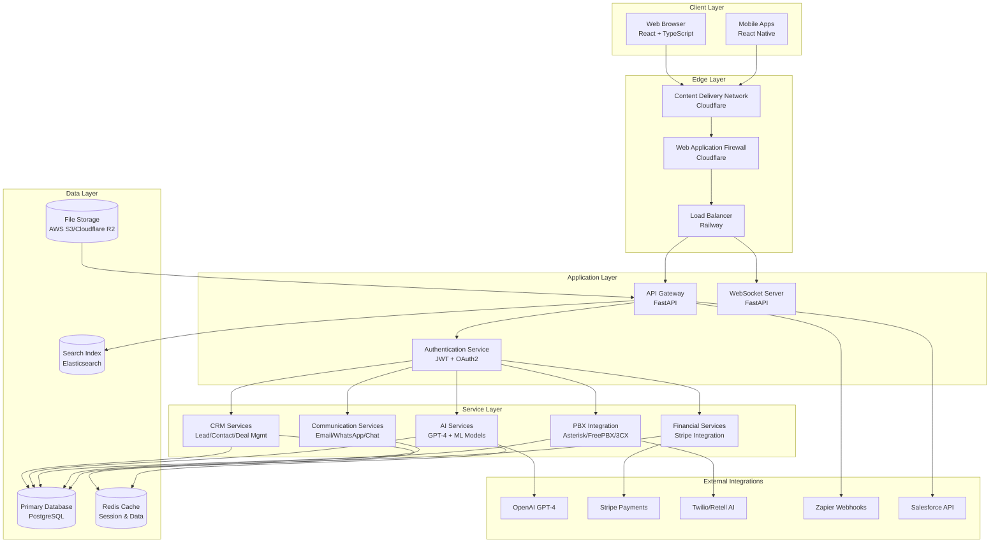
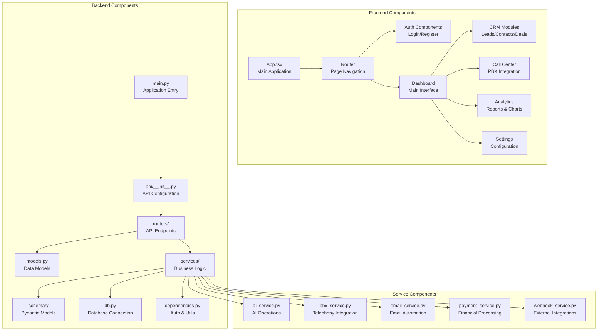
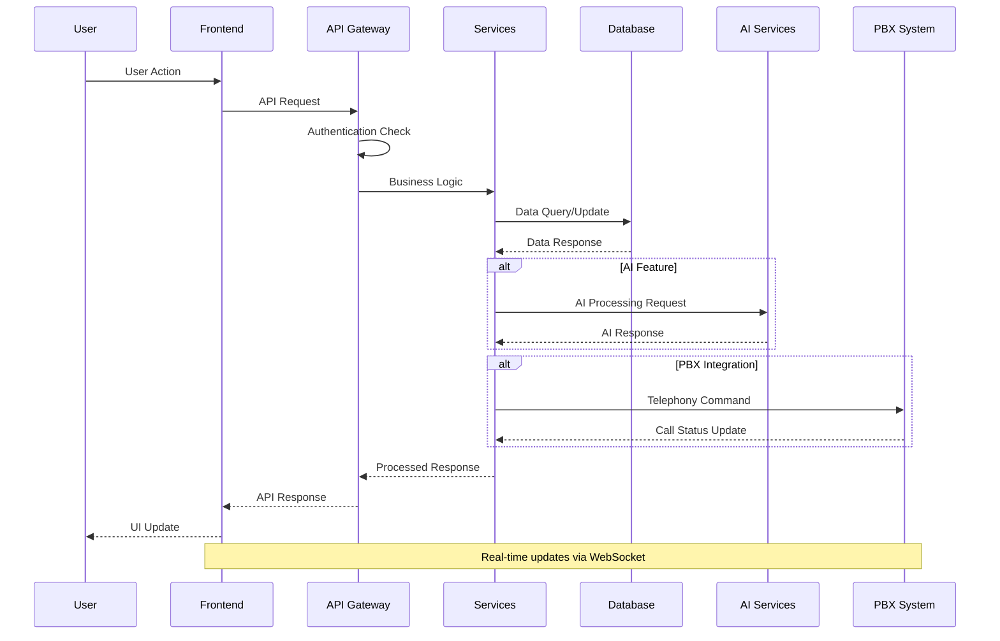
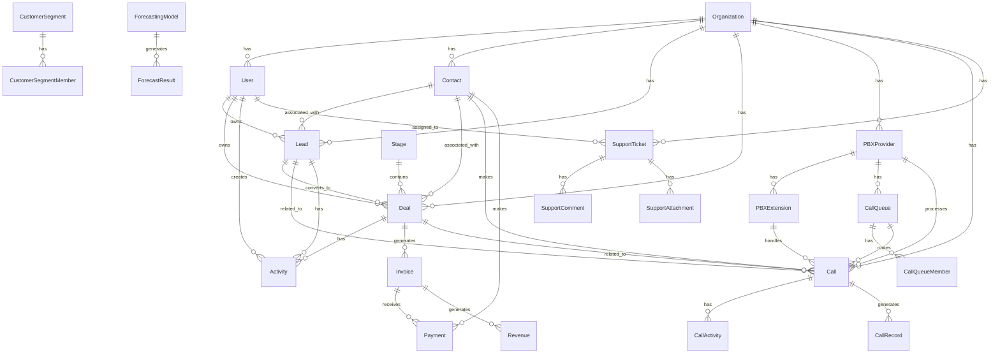
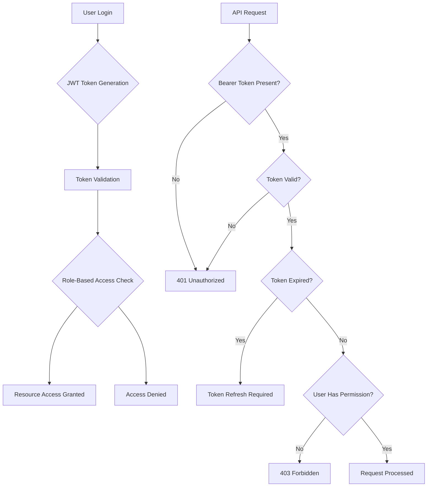
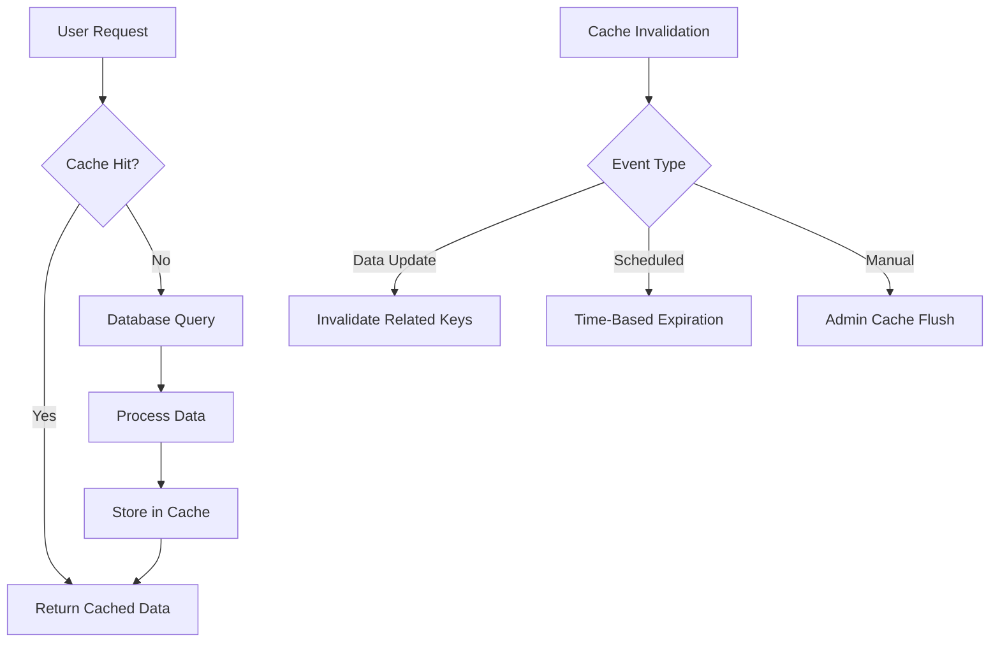
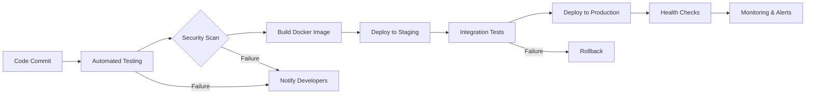
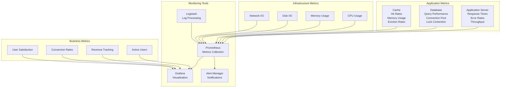

# Architecture & Design Documentation

## 1. System Architecture Overview

### 1.1 High-Level Architecture



### 1.2 Technology Stack Rationale

#### Frontend Technologies
- **React 18 + TypeScript**: Modern, type-safe development with excellent ecosystem
- **Tailwind CSS**: Utility-first CSS framework for rapid UI development
- **Vite**: Fast build tool with hot module replacement
- **React Router**: Client-side routing for SPA experience
- **Axios**: HTTP client with request/response interceptors

**Rationale**: React provides excellent developer experience and performance. TypeScript ensures type safety and better maintainability. Tailwind enables rapid prototyping while maintaining design consistency.

#### Backend Technologies
- **FastAPI**: High-performance Python web framework with automatic API documentation
- **SQLAlchemy**: Powerful ORM with async support and migration tools
- **PostgreSQL**: Robust, ACID-compliant database with advanced features
- **Redis**: High-performance caching and session storage
- **WebSocket**: Real-time bidirectional communication

**Rationale**: FastAPI offers excellent performance and automatic OpenAPI documentation. PostgreSQL provides enterprise-grade reliability. Redis enables high-performance caching for AI responses and session data.

#### AI & ML Technologies
- **OpenAI GPT-4**: State-of-the-art language model for intelligent features
- **Custom ML Models**: Specialized models for lead scoring and forecasting
- **Scikit-learn**: Machine learning library for predictive analytics
- **TensorFlow/PyTorch**: Deep learning frameworks for advanced models

**Rationale**: GPT-4 provides superior intelligence for sales assistance and content generation. Custom models ensure domain-specific accuracy for CRM predictions.

#### Infrastructure Technologies
- **Railway**: Cloud platform with automatic scaling and managed infrastructure
- **Docker**: Containerization for consistent deployment
- **PostgreSQL**: Primary database with advanced indexing
- **Redis**: Caching layer for performance optimization
- **Cloudflare**: CDN and security layer

**Rationale**: Railway simplifies deployment and scaling. Docker ensures environment consistency. PostgreSQL handles complex CRM data relationships efficiently.

## 2. Component Architecture

### 2.1 Core Components



### 2.2 Data Flow Architecture



## 3. Database Architecture

### 3.1 Entity-Relationship Diagram



### 3.2 Database Design Principles

#### Normalization Strategy
- **3NF Compliance**: Eliminates transitive dependencies and redundancy
- **Surrogate Keys**: Auto-incrementing integer primary keys for performance
- **Natural Keys**: Business-meaningful unique constraints where appropriate
- **Audit Fields**: Created/updated timestamps on all tables

#### Indexing Strategy
- **Primary Keys**: Clustered indexes on all primary keys
- **Foreign Keys**: Non-clustered indexes on foreign key columns
- **Composite Indexes**: Multi-column indexes for common query patterns
- **Partial Indexes**: Filtered indexes for active records
- **GIN Indexes**: For JSON and array columns in PostgreSQL

#### Partitioning Strategy
- **Time-Based Partitioning**: Call records and activities partitioned by month
- **Organization-Based Partitioning**: Multi-tenant data isolation
- **Hash Partitioning**: Large tables distributed across multiple partitions

### 3.3 Data Access Patterns

#### Repository Pattern Implementation
```python
class BaseRepository:
    def __init__(self, db: Session):
        self.db = db

    def get_by_id(self, id: int) -> Optional[T]:
        return self.db.query(self.model).filter(self.model.id == id).first()

    def get_all(self, skip: int = 0, limit: int = 100) -> List[T]:
        return self.db.query(self.model).offset(skip).limit(limit).all()

    def create(self, obj: T) -> T:
        self.db.add(obj)
        self.db.commit()
        self.db.refresh(obj)
        return obj

    def update(self, id: int, obj_data: Dict) -> Optional[T]:
        obj = self.get_by_id(id)
        if obj:
            for key, value in obj_data.items():
                setattr(obj, key, value)
            self.db.commit()
            self.db.refresh(obj)
        return obj

    def delete(self, id: int) -> bool:
        obj = self.get_by_id(id)
        if obj:
            self.db.delete(obj)
            self.db.commit()
            return True
        return False
```

## 4. API Architecture

### 4.1 RESTful API Design

#### Endpoint Organization
```
/api/
├── auth/                 # Authentication endpoints
│   ├── login            # POST /api/auth/login
│   ├── logout           # POST /api/auth/logout
│   ├── me               # GET /api/auth/me
│   └── refresh          # POST /api/auth/refresh
├── users/               # User management
├── organizations/       # Organization management
├── leads/               # Lead management
├── contacts/            # Contact management
├── deals/               # Deal/opportunity management
├── kanban/              # Kanban board operations
├── activities/          # Activity logging
├── ai/                  # AI-powered features
│   ├── assistant        # AI sales assistant
│   ├── lead-scoring     # Lead scoring service
│   ├── sentiment-analysis # Sentiment analysis
│   └── forecasting      # Sales forecasting
├── telephony/           # Call center operations
│   ├── providers        # PBX provider management
│   ├── calls            # Call management
│   ├── queues           # Call queue management
│   └── analytics        # Call analytics
├── support/             # Customer support
│   ├── tickets          # Support ticket management
│   ├── knowledge-base   # Knowledge base
│   └── analytics        # Support analytics
├── financial/           # Financial management
│   ├── invoices         # Invoice management
│   ├── payments         # Payment processing
│   └── reports          # Financial reports
├── automation/          # Workflow automation
│   ├── workflows        # Workflow management
│   ├── rules            # Business rules
│   └── triggers         # Event triggers
└── notifications/       # Notification system
```

#### API Response Format
```json
{
  "success": true,
  "data": {
    "id": 123,
    "name": "John Doe",
    "email": "john@example.com",
    "created_at": "2024-01-01T00:00:00Z"
  },
  "meta": {
    "page": 1,
    "per_page": 20,
    "total": 150
  },
  "message": "Resource created successfully"
}
```

### 4.2 WebSocket Architecture

#### Real-Time Communication Channels
```javascript
// Connection establishment
const ws = new WebSocket('ws://localhost:8000/ws?token=' + authToken);

// Channel subscriptions
ws.send(JSON.stringify({
  type: 'subscribe',
  channels: ['organization:123', 'user:456', 'deal:789']
}));

// Message handling
ws.onmessage = (event) => {
  const message = JSON.parse(event.data);
  switch(message.type) {
    case 'deal_updated':
      updateDealInUI(message.data);
      break;
    case 'new_call':
      showCallNotification(message.data);
      break;
    case 'ai_insight':
      displayAIInsight(message.data);
      break;
  }
};
```

#### WebSocket Event Types
- **deal_updated**: Deal stage or information changes
- **lead_scored**: AI lead scoring completion
- **call_started**: New call initiated
- **call_ended**: Call completion with summary
- **ticket_assigned**: Support ticket assignment
- **notification**: General system notifications
- **ai_insight**: AI-generated insights and recommendations

## 5. Security Architecture

### 5.1 Authentication & Authorization



#### Security Layers
1. **Network Layer**: Cloudflare WAF and DDoS protection
2. **Application Layer**: Input validation and sanitization
3. **Authentication Layer**: JWT with refresh token rotation
4. **Authorization Layer**: Role-based and attribute-based access control
5. **Data Layer**: Encryption at rest and in transit
6. **Audit Layer**: Comprehensive logging and monitoring

### 5.2 Data Protection

#### Encryption Strategy
- **Data in Transit**: TLS 1.3 with perfect forward secrecy
- **Data at Rest**: AES-256 encryption for sensitive data
- **Key Management**: AWS KMS or equivalent for key rotation
- **Password Storage**: bcrypt with salt and pepper

#### Privacy Compliance
- **GDPR Compliance**: Data minimization and consent management
- **CCPA Compliance**: Data subject rights and opt-out mechanisms
- **Data Retention**: Automated data lifecycle management
- **Audit Trails**: Complete user action logging

## 6. Performance Architecture

### 6.1 Caching Strategy



#### Cache Layers
1. **Browser Cache**: Static assets and API responses
2. **CDN Cache**: Global content delivery
3. **Application Cache**: Redis for dynamic data
4. **Database Cache**: PostgreSQL shared buffers

### 6.2 Scalability Design

#### Horizontal Scaling
- **Stateless Services**: All services can be scaled horizontally
- **Database Sharding**: Organization-based data partitioning
- **Load Balancing**: Round-robin with health checks
- **Auto-scaling**: Based on CPU and memory utilization

#### Performance Optimization
- **Database Indexing**: Optimized for common query patterns
- **Query Optimization**: Efficient SQL with proper joins
- **Async Processing**: Background jobs for heavy operations
- **CDN Integration**: Global content delivery

## 7. Deployment Architecture

### 7.1 Containerization Strategy

```dockerfile
# Multi-stage Docker build
FROM node:18-alpine AS frontend-build
WORKDIR /app
COPY frontend/package*.json ./
RUN npm ci
COPY frontend/ .
RUN npm run build

FROM python:3.9-slim AS backend-build
WORKDIR /app
COPY backend/requirements.txt .
RUN pip install --no-cache-dir -r requirements.txt
COPY backend/ .

FROM nginx:alpine AS production
# Copy built frontend
COPY --from=frontend-build /app/dist /usr/share/nginx/html
# Copy backend
COPY --from=backend-build /app /app
# Nginx configuration
COPY nginx.conf /etc/nginx/nginx.conf
EXPOSE 80 8000
CMD ["sh", "-c", "nginx && uvicorn main:app --host 0.0.0.0 --port 8000"]
```

### 7.2 CI/CD Pipeline



#### Deployment Strategy
- **Blue-Green Deployment**: Zero-downtime deployments
- **Canary Releases**: Gradual rollout with feature flags
- **Database Migrations**: Automated schema updates with rollback
- **Health Checks**: Comprehensive service monitoring

## 8. Monitoring & Observability

### 8.1 Monitoring Stack



### 8.2 Logging Strategy

#### Log Levels and Formats
- **ERROR**: System errors requiring immediate attention
- **WARN**: Potential issues or unusual conditions
- **INFO**: General operational messages
- **DEBUG**: Detailed debugging information

#### Centralized Logging
- **Structured Logging**: JSON format with consistent fields
- **Log Aggregation**: ELK stack or equivalent
- **Log Retention**: 90 days hot storage, 1 year cold storage
- **Log Analysis**: Automated pattern detection and alerting

### 8.3 Alerting Strategy

#### Alert Categories
- **Critical**: System down, data loss, security breaches
- **Warning**: Performance degradation, high error rates
- **Info**: Maintenance notifications, unusual patterns

#### Escalation Process
1. **Immediate**: Critical alerts to on-call engineer
2. **15 minutes**: Warning alerts if not acknowledged
3. **1 hour**: Info alerts for review
4. **Escalation**: Manager notification for unresolved issues

This comprehensive architecture documentation provides the technical foundation for NeuraCRM, ensuring scalability, security, and maintainability while delivering enterprise-grade performance and reliability.