# Data Model & Schema Documentation

## 1. Database Overview

### 1.1 Database Technology
- **Primary Database**: PostgreSQL 13+
- **ORM**: SQLAlchemy 1.4+ with async support
- **Migration Tool**: Alembic
- **Connection Pooling**: SQLAlchemy async engine
- **Indexing**: B-tree, GIN, and partial indexes

### 1.2 Database Architecture Principles

#### Normalization Strategy
- **3NF Compliance**: Eliminates transitive dependencies
- **Surrogate Keys**: Auto-incrementing integer primary keys
- **Natural Keys**: Business-meaningful unique constraints
- **Audit Fields**: Created/updated timestamps on all tables

#### Partitioning Strategy
- **Time-Based Partitioning**: Call records and activities by month
- **Organization-Based Partitioning**: Multi-tenant data isolation
- **Hash Partitioning**: Large tables distributed across partitions

#### Indexing Strategy
- **Primary Keys**: Clustered indexes on all primary keys
- **Foreign Keys**: Non-clustered indexes on foreign key columns
- **Composite Indexes**: Multi-column indexes for common queries
- **Partial Indexes**: Filtered indexes for active records
- **GIN Indexes**: For JSON and array columns

## 2. Core Entity-Relationship Diagram

```mermaid
erDiagram
    Organization ||--o{ User : has
    Organization ||--o{ Contact : has
    Organization ||--o{ Lead : has
    Organization ||--o{ Deal : has
    Organization ||--o{ PBXProvider : has
    Organization ||--o{ Call : has
    Organization ||--o{ SupportTicket : has
    Organization ||--o{ CustomerSegment : has
    Organization ||--o{ ForecastingModel : has

    User ||--o{ Lead : owns
    User ||--o{ Deal : owns
    User ||--o{ Activity : creates
    User ||--o{ SupportTicket : "assigned_to/created_by/resolved_by"
    User ||--o{ ChatRoom : created_by
    User ||--o{ ChatMessage : sender
    User ||--o{ PBXProvider : creator
    User ||--o{ CallCampaign : creator

    Contact ||--o{ Lead : associated_with
    Contact ||--o{ Deal : associated_with
    Contact ||--o{ Call : makes
    Contact ||--o{ Payment : makes
    Contact ||--o{ CustomerAccount : has
    Contact ||--o{ SupportTicket : customer

    Lead ||--o{ Deal : converts_to
    Lead ||--o{ Call : related_to
    Lead ||--o{ Activity : has
    Lead ||--o{ CallRecord : associated_with

    Deal ||--o{ Activity : has
    Deal ||--o{ Invoice : generates
    Deal ||--o{ Call : related_to
    Deal ||--o{ CustomerAccount : creates

    Stage ||--o{ Deal : contains

    PBXProvider ||--o{ PBXExtension : has
    PBXProvider ||--o{ CallQueue : has
    PBXProvider ||--o{ Call : processes

    PBXExtension ||--o{ Call : handles
    PBXExtension ||--o{ CallQueueMember : belongs_to

    Call ||--o{ CallActivity : has
    Call ||--o{ CallRecord : generates
    Call ||--o{ CallAnalytics : contributes_to

    CallQueue ||--o{ CallQueueMember : has
    CallQueue ||--o{ Call : routes

    CallCampaign ||--o{ CampaignCall : has

    SupportTicket ||--o{ SupportComment : has
    SupportTicket ||--o{ SupportAttachment : has
    SupportTicket ||--o{ CustomerSatisfactionSurvey : has

    KnowledgeBaseArticle ||--o{ SupportTicket : references

    CustomerSegment ||--o{ CustomerSegmentMember : has
    CustomerSegment ||--o{ SegmentAnalytics : has

    ForecastingModel ||--o{ ForecastResult : generates

    Invoice ||--o{ Payment : receives
    Invoice ||--o{ Revenue : generates

    ChatRoom ||--o{ ChatParticipant : has
    ChatRoom ||--o{ ChatMessage : has

    ChatMessage ||--o{ ChatReaction : has
    ChatMessage ||--o{ ChatMessage : "reply_to"
```



## 3. Detailed Table Schemas

### 3.1 Organizations Table

**Purpose**: Multi-tenant organization management

```sql
CREATE TABLE organizations (
    id SERIAL PRIMARY KEY,
    name VARCHAR(255) NOT NULL,
    domain VARCHAR(255) UNIQUE,
    settings TEXT,
    created_at TIMESTAMP WITH TIME ZONE DEFAULT CURRENT_TIMESTAMP,

    -- Indexes
    INDEX idx_organizations_domain (domain),
    INDEX idx_organizations_created_at (created_at)
);
```

**Key Fields**:
- `id`: Primary key, auto-increment
- `name`: Organization display name
- `domain`: Unique domain for organization
- `settings`: JSON string for org-specific settings

**Relationships**:
- One-to-many with Users, Contacts, Leads, Deals
- One-to-many with PBX providers and call center entities

### 3.2 Users Table

**Purpose**: User accounts and authentication

```sql
CREATE TABLE users (
    id SERIAL PRIMARY KEY,
    name VARCHAR(255) NOT NULL,
    email VARCHAR(255) NOT NULL,
    password_hash VARCHAR(255) NOT NULL,
    avatar_url VARCHAR(500),
    role VARCHAR(50) DEFAULT 'agent',
    organization_id INTEGER NOT NULL REFERENCES organizations(id),
    created_at TIMESTAMP WITH TIME ZONE DEFAULT CURRENT_TIMESTAMP,

    -- Indexes
    INDEX idx_users_email_org (email, organization_id),
    INDEX idx_users_organization_id (organization_id),
    INDEX idx_users_role (role),

    -- Constraints
    UNIQUE (email, organization_id)
);
```

**Key Fields**:
- `role`: admin, manager, agent, customer
- `organization_id`: Multi-tenant isolation
- `password_hash`: bcrypt hashed password

**Relationships**:
- Many-to-one with Organization
- One-to-many with Leads, Deals, Activities

### 3.3 Contacts Table

**Purpose**: Customer and prospect contact information

```sql
CREATE TABLE contacts (
    id SERIAL PRIMARY KEY,
    name VARCHAR(255) NOT NULL,
    email VARCHAR(255),
    phone VARCHAR(50),
    company VARCHAR(255),
    owner_id INTEGER REFERENCES users(id),
    organization_id INTEGER NOT NULL REFERENCES organizations(id),
    created_at TIMESTAMP WITH TIME ZONE DEFAULT CURRENT_TIMESTAMP,

    -- Indexes
    INDEX idx_contacts_email (email),
    INDEX idx_contacts_company (company),
    INDEX idx_contacts_owner_id (owner_id),
    INDEX idx_contacts_organization_id (organization_id)
);
```

**Key Fields**:
- `owner_id`: User responsible for this contact
- `organization_id`: Multi-tenant isolation

**Relationships**:
- Many-to-one with Organization and User
- One-to-many with Leads and Deals

### 3.4 Leads Table

**Purpose**: Sales lead management and qualification

```sql
CREATE TABLE leads (
    id SERIAL PRIMARY KEY,
    title VARCHAR(500) NOT NULL,
    contact_id INTEGER REFERENCES contacts(id),
    owner_id INTEGER REFERENCES users(id),
    organization_id INTEGER NOT NULL REFERENCES organizations(id),
    status VARCHAR(50),
    source VARCHAR(100),
    score INTEGER DEFAULT 0,
    score_updated_at TIMESTAMP WITH TIME ZONE,
    score_factors TEXT,
    score_confidence REAL DEFAULT 0.0,
    created_at TIMESTAMP WITH TIME ZONE DEFAULT CURRENT_TIMESTAMP,

    -- Indexes
    INDEX idx_leads_owner_id (owner_id),
    INDEX idx_leads_organization_id (organization_id),
    INDEX idx_leads_status (status),
    INDEX idx_leads_score (score),
    INDEX idx_leads_contact_id (contact_id),
    INDEX idx_leads_created_at (created_at)
);
```

**Key Fields**:
- `score`: AI-calculated lead score (0-100)
- `score_factors`: JSON string of scoring components
- `score_confidence`: AI confidence in scoring (0.0-1.0)

**Relationships**:
- Many-to-one with Contact, User, Organization
- One-to-one with Deal (upon conversion)

### 3.5 Deals Table

**Purpose**: Sales opportunity and pipeline management

```sql
CREATE TABLE deals (
    id SERIAL PRIMARY KEY,
    title VARCHAR(500) NOT NULL,
    value DECIMAL(15,2),
    owner_id INTEGER REFERENCES users(id),
    stage_id INTEGER REFERENCES stages(id),
    organization_id INTEGER NOT NULL REFERENCES organizations(id),
    description TEXT,
    created_at TIMESTAMP WITH TIME ZONE DEFAULT CURRENT_TIMESTAMP,
    closed_at TIMESTAMP WITH TIME ZONE,
    reminder_date TIMESTAMP WITH TIME ZONE,
    contact_id INTEGER REFERENCES contacts(id),
    status VARCHAR(20) DEFAULT 'open',
    outcome_reason VARCHAR(255),
    customer_account_id INTEGER REFERENCES customer_accounts(id),

    -- Indexes
    INDEX idx_deals_owner_id (owner_id),
    INDEX idx_deals_stage_id (stage_id),
    INDEX idx_deals_organization_id (organization_id),
    INDEX idx_deals_status (status),
    INDEX idx_deals_contact_id (contact_id),
    INDEX idx_deals_value (value),
    INDEX idx_deals_created_at (created_at)
);
```

**Key Fields**:
- `value`: Deal monetary value
- `stage_id`: Current pipeline stage
- `status`: open, won, lost
- `outcome_reason`: Reason for won/lost status

**Relationships**:
- Many-to-one with User, Stage, Organization, Contact
- One-to-many with Activities and Invoices

### 3.6 Stages Table

**Purpose**: Kanban pipeline stage configuration

```sql
CREATE TABLE stages (
    id SERIAL PRIMARY KEY,
    name VARCHAR(100) NOT NULL,
    order INTEGER,
    wip_limit INTEGER,

    -- Indexes
    UNIQUE (name),
    INDEX idx_stages_order (order)
);
```

**Key Fields**:
- `order`: Display order in pipeline
- `wip_limit`: Work-in-progress limit for stage

### 3.7 Activities Table

**Purpose**: Activity logging and timeline tracking

```sql
CREATE TABLE activities (
    id SERIAL PRIMARY KEY,
    deal_id INTEGER REFERENCES deals(id),
    user_id INTEGER REFERENCES users(id),
    type VARCHAR(50),
    message TEXT,
    timestamp TIMESTAMP WITH TIME ZONE DEFAULT CURRENT_TIMESTAMP,

    -- Indexes
    INDEX idx_activities_deal_id (deal_id),
    INDEX idx_activities_user_id (user_id),
    INDEX idx_activities_type (type),
    INDEX idx_activities_timestamp (timestamp)
);
```

**Key Fields**:
- `type`: call, email, meeting, note, etc.
- `message`: Activity description or content
- `timestamp`: When activity occurred

### 3.8 PBX Providers Table

**Purpose**: Telephony system integration configuration

```sql
CREATE TABLE pbx_providers (
    id SERIAL PRIMARY KEY,
    organization_id INTEGER NOT NULL REFERENCES organizations(id),
    name VARCHAR(255) NOT NULL,
    provider_type VARCHAR(50) NOT NULL,
    display_name VARCHAR(255) NOT NULL,
    description TEXT,
    host VARCHAR(255) NOT NULL,
    port INTEGER DEFAULT 5060,
    username VARCHAR(255) NOT NULL,
    password VARCHAR(255) NOT NULL,
    transport VARCHAR(10) DEFAULT 'UDP',
    context VARCHAR(100) DEFAULT 'default',
    is_active BOOLEAN DEFAULT true,
    is_primary BOOLEAN DEFAULT false,
    created_by INTEGER REFERENCES users(id),
    created_at TIMESTAMP WITH TIME ZONE DEFAULT CURRENT_TIMESTAMP,

    -- Indexes
    INDEX idx_pbx_providers_organization_id (organization_id),
    INDEX idx_pbx_providers_provider_type (provider_type),
    INDEX idx_pbx_providers_is_active (is_active),
    INDEX idx_pbx_providers_is_primary (is_primary)
);
```

**Key Fields**:
- `provider_type`: asterisk, freepbx, 3cx, twilio, etc.
- `is_primary`: Primary provider for organization
- `transport`: SIP transport protocol

### 3.9 Calls Table

**Purpose**: Call detail records and call management

```sql
CREATE TABLE calls (
    id SERIAL PRIMARY KEY,
    organization_id INTEGER NOT NULL REFERENCES organizations(id),
    provider_id INTEGER REFERENCES pbx_providers(id),
    extension_id INTEGER REFERENCES pbx_extensions(id),
    unique_id VARCHAR(255) UNIQUE NOT NULL,
    pbx_call_id VARCHAR(255),
    session_id VARCHAR(255),
    caller_id VARCHAR(50) NOT NULL,
    caller_name VARCHAR(255),
    called_number VARCHAR(50) NOT NULL,
    called_name VARCHAR(255),
    direction VARCHAR(20) NOT NULL,
    call_type VARCHAR(20) DEFAULT 'voice',
    contact_id INTEGER REFERENCES contacts(id),
    lead_id INTEGER REFERENCES leads(id),
    deal_id INTEGER REFERENCES deals(id),
    agent_id INTEGER REFERENCES users(id),
    queue_id INTEGER REFERENCES call_queues(id),
    status VARCHAR(50) NOT NULL,
    start_time TIMESTAMP WITH TIME ZONE NOT NULL,
    answer_time TIMESTAMP WITH TIME ZONE,
    end_time TIMESTAMP WITH TIME ZONE,
    duration INTEGER DEFAULT 0,
    talk_time INTEGER DEFAULT 0,
    hold_time INTEGER DEFAULT 0,
    wait_time INTEGER DEFAULT 0,
    quality_score REAL,
    recording_url VARCHAR(500),
    recording_duration INTEGER,
    transcription_url VARCHAR(500),
    transcription_text TEXT,
    disposition VARCHAR(50),
    hangup_cause VARCHAR(100),
    notes TEXT,
    cost DECIMAL(10,4) DEFAULT 0.0,
    cost_currency VARCHAR(3) DEFAULT 'USD',
    cdr_data JSONB,
    created_at TIMESTAMP WITH TIME ZONE DEFAULT CURRENT_TIMESTAMP,

    -- Indexes
    INDEX idx_calls_organization_id (organization_id),
    INDEX idx_calls_provider_id (provider_id),
    INDEX idx_calls_contact_id (contact_id),
    INDEX idx_calls_lead_id (lead_id),
    INDEX idx_calls_deal_id (deal_id),
    INDEX idx_calls_agent_id (agent_id),
    INDEX idx_calls_status (status),
    INDEX idx_calls_direction (direction),
    INDEX idx_calls_start_time (start_time),
    INDEX idx_calls_duration (duration),
    INDEX idx_calls_unique_id (unique_id),
    INDEX idx_calls_cdr_data ((cdr_data))
);
```

**Key Fields**:
- `unique_id`: PBX unique call identifier
- `direction`: inbound, outbound, internal
- `cdr_data`: Complete call detail record as JSON
- `quality_score`: AI-calculated call quality score

### 3.10 Support Tickets Table

**Purpose**: Customer support ticket management

```sql
CREATE TABLE support_tickets (
    id SERIAL PRIMARY KEY,
    ticket_number VARCHAR(50) UNIQUE NOT NULL,
    organization_id INTEGER NOT NULL REFERENCES organizations(id),
    title VARCHAR(500) NOT NULL,
    description TEXT NOT NULL,
    priority VARCHAR(20) DEFAULT 'medium',
    status VARCHAR(30) DEFAULT 'open',
    category VARCHAR(50) NOT NULL,
    subcategory VARCHAR(100),
    customer_account_id INTEGER REFERENCES customer_accounts(id),
    contact_id INTEGER REFERENCES contacts(id),
    customer_email VARCHAR(255) NOT NULL,
    customer_name VARCHAR(255) NOT NULL,
    assigned_to_id INTEGER REFERENCES users(id),
    assigned_at TIMESTAMP WITH TIME ZONE,
    queue_id INTEGER REFERENCES support_queues(id),
    sla_deadline TIMESTAMP WITH TIME ZONE,
    first_response_at TIMESTAMP WITH TIME ZONE,
    resolution_deadline TIMESTAMP WITH TIME ZONE,
    resolution TEXT,
    resolution_notes TEXT,
    resolved_at TIMESTAMP WITH TIME ZONE,
    resolved_by_id INTEGER REFERENCES users(id),
    closure_reason VARCHAR(100),
    closure_category VARCHAR(100),
    follow_up_required BOOLEAN DEFAULT false,
    follow_up_date TIMESTAMP WITH TIME ZONE,
    follow_up_notes TEXT,
    customer_satisfied BOOLEAN,
    internal_notes TEXT,
    ai_summary TEXT,
    ai_summary_generated_at TIMESTAMP WITH TIME ZONE,
    ai_summary_model VARCHAR(100),
    created_by INTEGER REFERENCES users(id),
    created_at TIMESTAMP WITH TIME ZONE DEFAULT CURRENT_TIMESTAMP,
    updated_at TIMESTAMP WITH TIME ZONE DEFAULT CURRENT_TIMESTAMP,
    closed_at TIMESTAMP WITH TIME ZONE,

    -- Indexes
    INDEX idx_support_tickets_ticket_number (ticket_number),
    INDEX idx_support_tickets_organization_id (organization_id),
    INDEX idx_support_tickets_status (status),
    INDEX idx_support_tickets_priority (priority),
    INDEX idx_support_tickets_category (category),
    INDEX idx_support_tickets_assigned_to_id (assigned_to_id),
    INDEX idx_support_tickets_customer_email (customer_email),
    INDEX idx_support_tickets_created_at (created_at),
    INDEX idx_support_tickets_sla_deadline (sla_deadline)
);
```

**Key Fields**:
- `ticket_number`: Human-readable ticket identifier
- `ai_summary`: AI-generated ticket summary
- `sla_deadline`: Service level agreement deadline

### 3.11 Invoices Table

**Purpose**: Financial invoice management

```sql
CREATE TABLE invoices (
    id SERIAL PRIMARY KEY,
    invoice_number VARCHAR(50) UNIQUE NOT NULL,
    deal_id INTEGER REFERENCES deals(id),
    customer_account_id INTEGER REFERENCES customer_accounts(id),
    organization_id INTEGER NOT NULL REFERENCES organizations(id),
    issue_date TIMESTAMP WITH TIME ZONE DEFAULT CURRENT_TIMESTAMP,
    due_date TIMESTAMP WITH TIME ZONE NOT NULL,
    status VARCHAR(30) DEFAULT 'draft',
    subtotal DECIMAL(15,2) NOT NULL,
    tax_rate DECIMAL(5,4) DEFAULT 0.0,
    tax_amount DECIMAL(15,2) DEFAULT 0.0,
    total_amount DECIMAL(15,2) NOT NULL,
    paid_amount DECIMAL(15,2) DEFAULT 0.0,
    balance_due DECIMAL(15,2) NOT NULL,
    description TEXT,
    notes TEXT,
    terms_conditions TEXT,
    created_by INTEGER REFERENCES users(id),
    created_at TIMESTAMP WITH TIME ZONE DEFAULT CURRENT_TIMESTAMP,
    updated_at TIMESTAMP WITH TIME ZONE DEFAULT CURRENT_TIMESTAMP,
    sent_at TIMESTAMP WITH TIME ZONE,
    paid_at TIMESTAMP WITH TIME ZONE,

    -- Indexes
    INDEX idx_invoices_invoice_number (invoice_number),
    INDEX idx_invoices_organization_id (organization_id),
    INDEX idx_invoices_deal_id (deal_id),
    INDEX idx_invoices_status (status),
    INDEX idx_invoices_due_date (due_date),
    INDEX idx_invoices_created_at (created_at)
);
```

**Key Fields**:
- `invoice_number`: Unique invoice identifier
- `balance_due`: Calculated remaining amount
- `status`: draft, sent, paid, overdue, cancelled

### 3.12 Customer Segments Table

**Purpose**: AI-powered customer segmentation

```sql
CREATE TABLE customer_segments (
    id SERIAL PRIMARY KEY,
    organization_id INTEGER NOT NULL REFERENCES organizations(id),
    name VARCHAR(255) NOT NULL,
    description TEXT,
    segment_type VARCHAR(50) DEFAULT 'behavioral',
    criteria JSONB NOT NULL,
    criteria_description TEXT,
    customer_count INTEGER DEFAULT 0,
    total_deal_value DECIMAL(15,2) DEFAULT 0.0,
    avg_deal_value DECIMAL(15,2) DEFAULT 0.0,
    conversion_rate DECIMAL(5,4) DEFAULT 0.0,
    insights JSONB,
    recommendations JSONB,
    risk_score DECIMAL(5,4) DEFAULT 0.0,
    opportunity_score DECIMAL(5,4) DEFAULT 0.0,
    is_active BOOLEAN DEFAULT true,
    is_auto_updated BOOLEAN DEFAULT true,
    last_updated TIMESTAMP WITH TIME ZONE DEFAULT CURRENT_TIMESTAMP,
    created_by INTEGER REFERENCES users(id),
    created_at TIMESTAMP WITH TIME ZONE DEFAULT CURRENT_TIMESTAMP,

    -- Indexes
    INDEX idx_customer_segments_organization_id (organization_id),
    INDEX idx_customer_segments_segment_type (segment_type),
    INDEX idx_customer_segments_is_active (is_active),
    INDEX idx_customer_segments_criteria ((criteria)),
    INDEX idx_customer_segments_risk_score (risk_score),
    INDEX idx_customer_segments_opportunity_score (opportunity_score)
);
```

**Key Fields**:
- `criteria`: JSON-based segmentation rules
- `insights`: AI-generated segment insights
- `risk_score`: Churn risk assessment (0.0-1.0)
- `opportunity_score`: Expansion opportunity score (0.0-1.0)

### 3.13 Forecasting Models Table

**Purpose**: Sales forecasting model configuration

```sql
CREATE TABLE forecasting_models (
    id SERIAL PRIMARY KEY,
    organization_id INTEGER NOT NULL REFERENCES organizations(id),
    name VARCHAR(255) NOT NULL,
    description TEXT,
    model_type VARCHAR(50) NOT NULL,
    data_source VARCHAR(50) NOT NULL,
    model_algorithm VARCHAR(50) NOT NULL,
    model_parameters JSONB,
    training_data_period VARCHAR(20) NOT NULL,
    forecast_horizon VARCHAR(20) NOT NULL,
    accuracy_metrics JSONB,
    is_active BOOLEAN DEFAULT true,
    last_trained TIMESTAMP WITH TIME ZONE,
    created_by INTEGER REFERENCES users(id),
    created_at TIMESTAMP WITH TIME ZONE DEFAULT CURRENT_TIMESTAMP,

    -- Indexes
    INDEX idx_forecasting_models_organization_id (organization_id),
    INDEX idx_forecasting_models_model_type (model_type),
    INDEX idx_forecasting_models_is_active (is_active),
    INDEX idx_forecasting_models_last_trained (last_trained)
);
```

**Key Fields**:
- `model_algorithm`: ARIMA, Prophet, Linear_Regression, etc.
- `accuracy_metrics`: Model performance metrics
- `forecast_horizon`: How far ahead to forecast

## 4. Key Relationships and Constraints

### 4.1 Foreign Key Relationships

#### Organization Isolation
All major entities are linked to `organization_id` for multi-tenant data isolation:

```sql
-- Example: All user data is organization-scoped
ALTER TABLE users ADD CONSTRAINT fk_users_organization
    FOREIGN KEY (organization_id) REFERENCES organizations(id);

-- Example: Leads are organization-scoped
ALTER TABLE leads ADD CONSTRAINT fk_leads_organization
    FOREIGN KEY (organization_id) REFERENCES organizations(id);
```

#### Business Logic Constraints
```sql
-- Deal stage progression
ALTER TABLE deals ADD CONSTRAINT chk_deal_status
    CHECK (status IN ('open', 'won', 'lost'));

-- Lead scoring range
ALTER TABLE leads ADD CONSTRAINT chk_lead_score
    CHECK (score >= 0 AND score <= 100);

-- Call direction validation
ALTER TABLE calls ADD CONSTRAINT chk_call_direction
    CHECK (direction IN ('inbound', 'outbound', 'internal'));
```

### 4.2 Association Tables

#### Deal-Tag Many-to-Many
```sql
CREATE TABLE deal_tag (
    deal_id INTEGER REFERENCES deals(id) ON DELETE CASCADE,
    tag_id INTEGER REFERENCES tags(id) ON DELETE CASCADE,
    PRIMARY KEY (deal_id, tag_id)
);
```

#### Deal Watcher Many-to-Many
```sql
CREATE TABLE watcher (
    deal_id INTEGER REFERENCES deals(id) ON DELETE CASCADE,
    user_id INTEGER REFERENCES users(id) ON DELETE CASCADE,
    PRIMARY KEY (deal_id, user_id)
);
```

## 5. Indexing Strategy

### 5.1 Performance Indexes

#### Query Optimization Indexes
```sql
-- Common lead queries
CREATE INDEX idx_leads_composite_search
    ON leads (organization_id, status, score, created_at);

-- Deal pipeline queries
CREATE INDEX idx_deals_pipeline_view
    ON deals (organization_id, owner_id, stage_id, status);

-- Call analytics queries
CREATE INDEX idx_calls_analytics
    ON calls (organization_id, start_time, direction, status, duration);

-- Support ticket queries
CREATE INDEX idx_support_tickets_sla
    ON support_tickets (organization_id, status, priority, sla_deadline);
```

#### JSON Indexes for Advanced Queries
```sql
-- Customer segment criteria queries
CREATE INDEX idx_customer_segments_criteria_gin
    ON customer_segments USING GIN (criteria);

-- Call detail record searches
CREATE INDEX idx_calls_cdr_gin
    ON calls USING GIN (cdr_data);

-- Forecasting model parameters
CREATE INDEX idx_forecasting_models_params_gin
    ON forecasting_models USING GIN (model_parameters);
```

### 5.2 Partial Indexes

#### Active Records Only
```sql
-- Active deals only
CREATE INDEX idx_deals_active_only
    ON deals (organization_id, stage_id, value)
    WHERE status = 'open';

-- Unresolved support tickets
CREATE INDEX idx_support_tickets_open_only
    ON support_tickets (organization_id, priority, created_at)
    WHERE status NOT IN ('resolved', 'closed');
```

## 6. Data Migration and Versioning

### 6.1 Alembic Migration Structure

```
backend/alembic/versions/
├── 001_initial_schema.py
├── 002_add_lead_scoring.py
├── 003_add_call_center.py
├── 004_add_support_system.py
├── 005_add_financial_management.py
├── 006_add_customer_segmentation.py
├── 007_add_forecasting_models.py
├── 008_add_conversational_ai.py
└── 009_performance_optimizations.py
```

### 6.2 Migration Best Practices

#### Safe Migrations
- **Additive Changes**: New columns with defaults
- **Non-Breaking**: Backward compatible schema changes
- **Rollback Support**: Every migration has a downgrade path
- **Data Preservation**: No data loss during migrations

#### Migration Example
```python
def upgrade():
    # Add new column with default
    op.add_column('leads',
        sa.Column('score_confidence', sa.Float(), default=0.0)
    )
    # Create index for performance
    op.create_index('idx_leads_score_confidence',
        'leads', ['score_confidence']
    )

def downgrade():
    # Remove index first
    op.drop_index('idx_leads_score_confidence')
    # Remove column
    op.drop_column('leads', 'score_confidence')
```

## 7. Data Access Patterns

### 7.1 Repository Pattern Implementation

```python
class BaseRepository:
    def __init__(self, db: AsyncSession):
        self.db = db

    async def get_by_id(self, id: int) -> Optional[T]:
        result = await self.db.execute(
            select(self.model).where(self.model.id == id)
        )
        return result.scalar_one_or_none()

    async def get_all(self, skip: int = 0, limit: int = 100) -> List[T]:
        result = await self.db.execute(
            select(self.model).offset(skip).limit(limit)
        )
        return result.scalars().all()

    async def create(self, obj: T) -> T:
        self.db.add(obj)
        await self.db.commit()
        await self.db.refresh(obj)
        return obj
```

### 7.2 Query Optimization

#### Efficient N+1 Query Prevention
```python
# Bad: N+1 queries
leads = await lead_repo.get_all()
for lead in leads:
    contact = await contact_repo.get_by_id(lead.contact_id)  # N queries

# Good: Single query with joins
query = select(Lead).options(selectinload(Lead.contact))
leads = await db.execute(query)
```

#### Pagination Strategy
```python
async def get_paginated_leads(
    organization_id: int,
    page: int = 1,
    per_page: int = 20,
    filters: Dict = None
) -> Dict:
    offset = (page - 1) * per_page

    query = select(Lead).where(Lead.organization_id == organization_id)

    if filters:
        if filters.get('status'):
            query = query.where(Lead.status == filters['status'])
        if filters.get('score_min'):
            query = query.where(Lead.score >= filters['score_min'])

    # Get total count
    count_query = select(func.count()).select_from(query.subquery())
    total = await db.execute(count_query)
    total_count = total.scalar()

    # Get paginated results
    query = query.offset(offset).limit(per_page)
    result = await db.execute(query)
    leads = result.scalars().all()

    return {
        'leads': leads,
        'total': total_count,
        'page': page,
        'per_page': per_page,
        'total_pages': (total_count + per_page - 1) // per_page
    }
```

## 8. Data Integrity and Validation

### 8.1 Database Constraints

#### Check Constraints
```sql
-- Lead score validation
ALTER TABLE leads ADD CONSTRAINT chk_lead_score_range
    CHECK (score >= 0 AND score <= 100);

-- Deal value validation
ALTER TABLE deals ADD CONSTRAINT chk_deal_value_positive
    CHECK (value > 0);

-- Email format validation (using domains)
ALTER TABLE contacts ADD CONSTRAINT chk_email_format
    CHECK (email ~ '^[A-Za-z0-9._%+-]+@[A-Za-z0-9.-]+\.[A-Za-z]{2,}$');
```

#### Unique Constraints
```sql
-- Organization-scoped uniqueness
ALTER TABLE users ADD CONSTRAINT uk_users_email_org
    UNIQUE (email, organization_id);

-- Global uniqueness
ALTER TABLE organizations ADD CONSTRAINT uk_organizations_domain
    UNIQUE (domain);
```

### 8.2 Application-Level Validation

#### Pydantic Models
```python
from pydantic import BaseModel, validator
from typing import Optional

class LeadCreate(BaseModel):
    title: str
    contact_id: Optional[int]
    status: str = 'new'

    @validator('title')
    def title_not_empty(cls, v):
        if not v.strip():
            raise ValueError('Title cannot be empty')
        return v

    @validator('status')
    def valid_status(cls, v):
        valid_statuses = ['new', 'contacted', 'qualified', 'unqualified']
        if v not in valid_statuses:
            raise ValueError(f'Status must be one of: {valid_statuses}')
        return v
```

## 9. Backup and Recovery

### 9.1 Backup Strategy

#### Automated Backups
- **Daily Full Backups**: Complete database snapshots
- **Hourly Incremental Backups**: Transaction log backups
- **Point-in-Time Recovery**: Up to 5 minutes granularity
- **Cross-Region Replication**: Disaster recovery copies

#### Backup Verification
```sql
-- Verify backup integrity
RESTORE VERIFYONLY FROM DISK = 'C:\backups\neuracrm_full.bak';

-- Test restore procedure monthly
RESTORE DATABASE NeuraCRM_Test FROM DISK = 'C:\backups\neuracrm_full.bak'
    WITH MOVE 'NeuraCRM' TO 'C:\data\NeuraCRM_Test.mdf',
         MOVE 'NeuraCRM_log' TO 'C:\data\NeuraCRM_Test.ldf';
```

### 9.2 Data Retention Policies

#### Retention Periods
- **Transaction Data**: 7 years (financial compliance)
- **Call Recordings**: 2 years (telecom regulations)
- **Support Tickets**: 5 years (customer service history)
- **Audit Logs**: 7 years (compliance requirements)
- **AI Training Data**: 3 years (model improvement)

#### Automated Cleanup
```sql
-- Archive old call records
INSERT INTO call_records_archive
SELECT * FROM calls
WHERE start_time < CURRENT_DATE - INTERVAL '2 years';

DELETE FROM calls
WHERE start_time < CURRENT_DATE - INTERVAL '2 years';
```

This comprehensive data model documentation provides the foundation for understanding NeuraCRM's database architecture, relationships, and data management strategies.